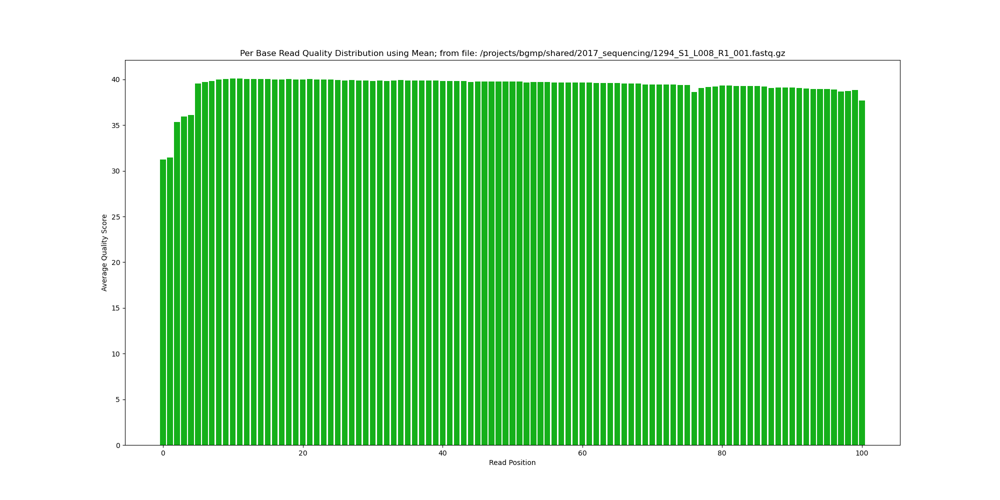
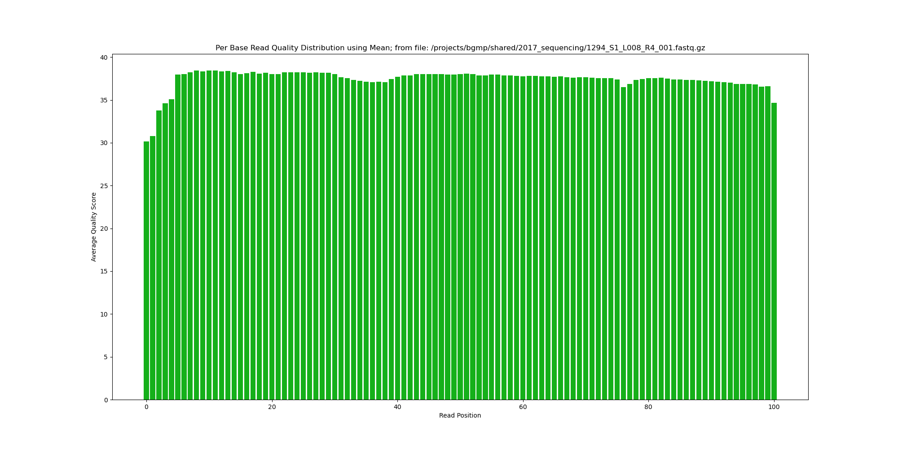

# Assignment the First

## Part 1
1. Be sure to upload your Python script.

| File name | label | Read length | Phred encoding |
|---|---|---|---|
| 1294_S1_L008_R1_001.fastq.gz | Read 1 | 101 | Phred+33 |
| 1294_S1_L008_R2_001.fastq.gz | Index 1 | 8 | Phred+33 |
| 1294_S1_L008_R3_001.fastq.gz | Index 2 | 8 | Phred+33 |
| 1294_S1_L008_R4_001.fastq.gz | Read 2 | 101 | Phred+33 |

2. Per-base NT distribution
    1. 
    
    
    
    
    2. **YOUR ANSWER HERE**
    3. Number of indexes that have undetermined (N) base calls
    ```zcat 1294_S1_L008_R2_001.fastq.gz | sed -n "2~4p" | grep "N" | wc -l```
    3,976,613
    ```zcat 1294_S1_L008_R3_001.fastq.gz | sed -n "2~4p" | grep "N" | wc -l```
    3,328,051

    
## Part 2
1. Define the problem
Given 4 fastq files and 24 known indexes, the output should be demultiplexed files that
have an R1.fastq and R2.fastq per matching index-pair, hopped_R1.fastq and hopped_R2.fastq for index
hopped records, unknown_R1.fastq and unknown_R2.fastq for unknown and lowQual_R1.fastq and lowQual_R2.fastq
for low quality index reads. Make these sorting decisions based off of corresponding index matching. Each 
record is matched to its physical location on the flow cell by position: first record in R1 corresponds to 
first record in R2 and R3 and R4, and so on and so forth. Also need to report the number of read-pairs with properly matched idexes, the number of index hopping, and the number of unknown indexes.
2. Describe output
The output files will include dual-matched fastq files for each barcode, an R1 and an R2 for each barcode to 
represent read 1 and read 2: paired ends. Additionally, there will be two files each for different flavors of
sorting: hopped, unknown, and low quality.
3. Upload your [4 input FASTQ files](../TEST-input_FASTQ) and your [>=6 expected output FASTQ files](../TEST-output_FASTQ).
4. Pseudocode
5. High level functions. For each function, be sure to include:
    1. Description/doc string
    2. Function headers (name and parameters)
    3. Test examples for individual functions
    4. Return statement
