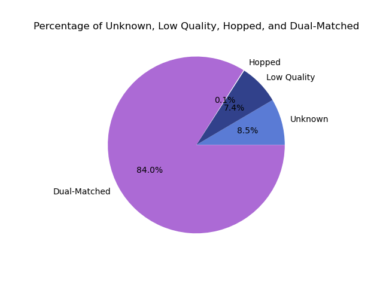

# Demultiplex: Assignment the third
## SJ Kim Bi622 2022

The directory ./demultiplexed/ only contains the summary_stats.txt from the demultiplexing.

demultiplex.py is the script that holds the demultiplexer.

bioinfo.py is the module that holds some functions used in demultiplex.py

run_demux.sh is the bash script for running the demultiplexer on the slurm.

pigz.sh is the bash script for running pigz after the demultiplexer finished.

My lab notebook for the entire Demultiplex assignment is in the Demultiplex/ folder, one level above this one.

pie.py plots a pie chart of the proportion of results compared to the total number of records.

Overall Index Hopping: 0.1% 

Percentage of Records from each Dual-matched Index are reported in /demultiplexed/summary_stats.txt
